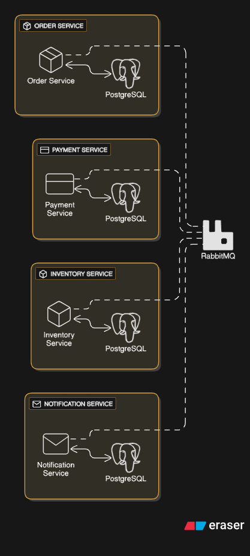
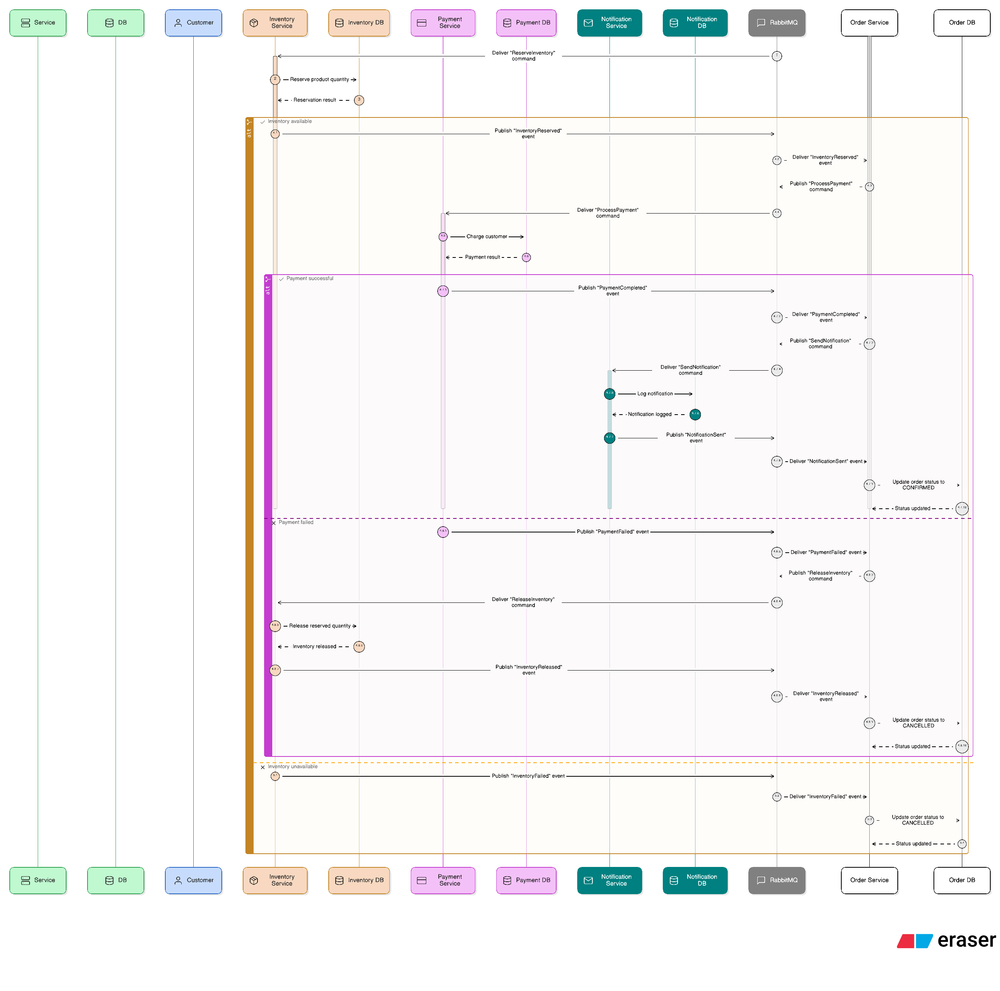
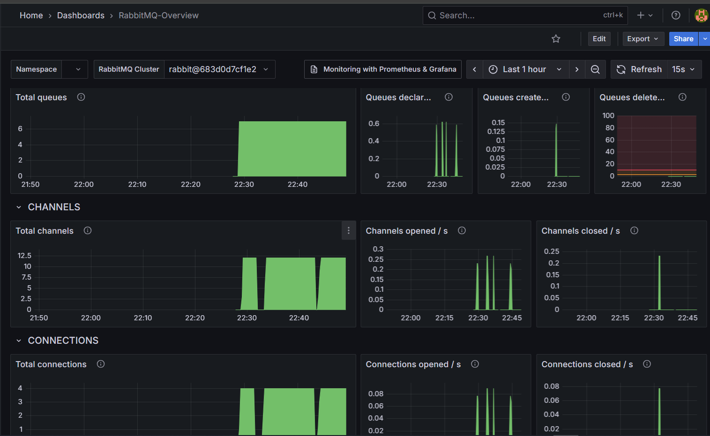
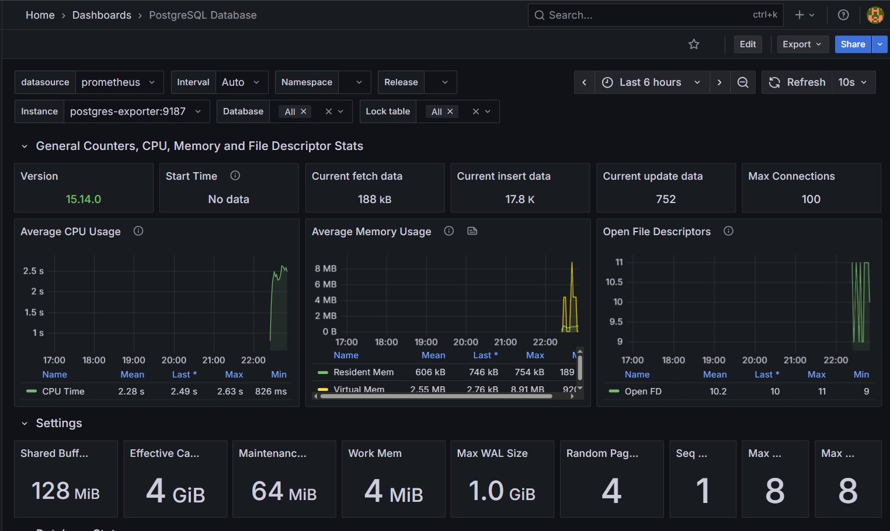
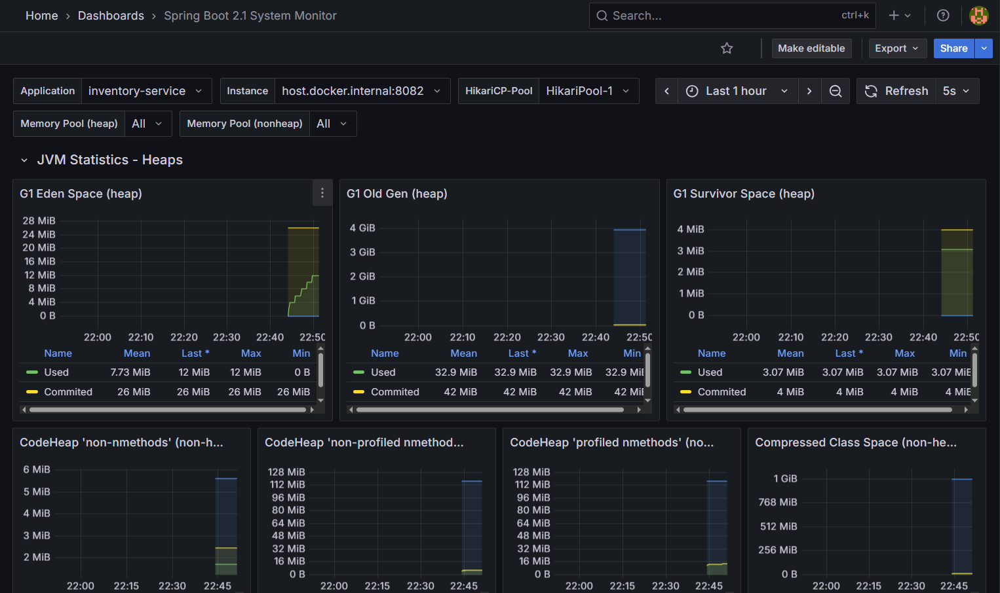
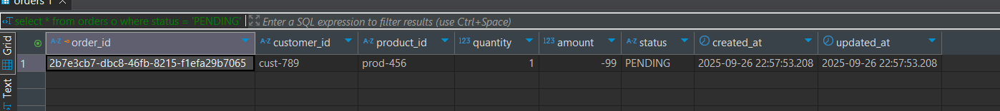
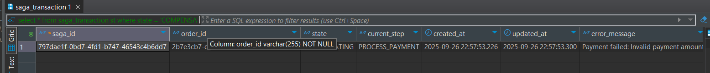
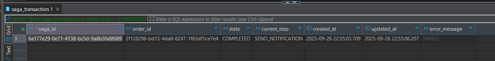
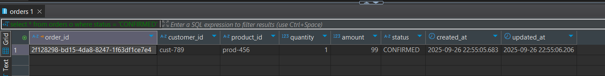
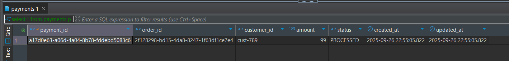

## Overview
This project demonstrates a complete implementation of the Saga Orchestration Pattern using Spring Boot, PostgreSQL, and RabbitMQ. It simulates an e-commerce order processing system where distributed transactions are coordinated across multiple microservices.

## Architecture




### Services
- Order Service (Port 8080) - Creates orders and orchestrates sagas
- Payment Service (Port 8081) - Processes payments and handles refunds
- Inventory Service (Port 8082) - Manages product inventory and reservations
- Notification Service (Port 8083) - Sends customer notifications

### Infra

- PostgreSQL - Individual databases for each service
- RabbitMQ - Message broker with topic exchanges and queues 
- Flyway - Database migration management
- Spring Boot Actuator - Health checks and monitoring
- Promosthues and Grafana - (RabbitMQ, Postgres, App services) Monitoring

## Service-to-Service communiation
This chart illustrates service to service communication for success and failure cases




## Saga Flow
### Happy Path
1. **Order Created** → Saga starts
2. **Reserve Inventory** → Inventory service reserves products
3. **Process Payment** → Payment service charges customer
4. **Send Notification** → Customer receives confirmation
5. **Complete Saga** → Order status updated to CONFIRMED

### Failure & Compensation
- **Inventory Failure** → Order cancelled immediately
- **Payment Failure** → Compensate inventory (release reservation)
- **Any Step Timeout** → Execute appropriate compensation

## Project Structure
```
saga-orchestration/
├── docker-compose.yml          # Infrastructure and services
├── build.sh                    # Build and setup script
├── test-saga.sh                # Testing script
├── shared/
│   └── saga-core/              # Shared models and events
├── order-service/              # Order management + Saga orchestrator
├── payment-service/            # Payment processing
├── inventory-service/          # Inventory management
└── notification-service/       # Customer notifications
```


## 🧪 Testing

### Manual Testing

**Successful Order:**
```bash
curl -X POST http://localhost:8080/api/orders \
  -H "Content-Type: application/json" \
  -d '{
    "customerId": "cust-123",
    "productId": "prod-456",
    "quantity": 2,
    "amount": 99.99
  }'
```

**Inventory Shortage (triggers immediate failure):**
```bash
curl -X POST http://localhost:8080/api/orders \
  -H "Content-Type: application/json" \
  -d '{
    "customerId": "cust-123",
    "productId": "prod-123",
    "quantity": 100,
    "amount": 999.99
  }'
```

**Payment Failure (triggers compensation):**
```bash
curl -X POST http://localhost:8080/api/orders \
  -H "Content-Type: application/json" \
  -d '{
    "customerId": "cust-123",
    "productId": "prod-456",
    "quantity": 2,
    "amount": -1
  }'
```


## 📊 Monitoring & Management

### Service Health
```bash
# Check all services
curl http://localhost:8080/actuator/health  # Order Service
curl http://localhost:8081/actuator/health  # Payment Service  
curl http://localhost:8082/actuator/health  # Inventory Service
curl http://localhost:8083/actuator/health  # Notification Service
```

### RabbitMQ Management
- **URL:** http://localhost:15672
- **Credentials:** admin/admin
- **Queues to monitor:**
    - `inventory.command.queue`
    - `payment.command.queue`
    - `notification.command.queue`
    - `saga.orchestrator.queue`

### Database Access
```bash
# Order Service DB
docker exec -it saga-order-db psql -U orderuser -d orderdb

# Payment Service DB  
docker exec -it saga-payment-db psql -U paymentuser -d paymentdb

# Inventory Service DB
docker exec -it saga-inventory-db psql -U inventoryuser -d inventorydb

# Notification Service DB
docker exec -it saga-notification-db psql -U notificationuser -d notificationdb
```

### Endpoints


### Order Service
- `POST /api/orders` - Create new order
- `GET /api/orders/{id}` - Get order details
- `GET /api/sagas/{sagaId}` - Get saga status

### Payment Service
- `GET /api/payments/{id}` - Get payment details
- `GET /api/payments/order/{orderId}` - Get payment by order

### Inventory Service
- `GET /api/inventory/{productId}` - Get inventory status
- `POST /api/inventory/init` - Initialize inventory (for testing)

### Notification Service
- `GET /api/notifications` - Get all notifications
- `GET /api/notifications/{id}` - Get notification details
- `GET /api/notifications/customer/{customerId}` - Get customer notifications

### Database Migrations
- Use Flyway migrations in `src/main/resources/db/migration/`
- Follow naming convention: `V{version}__{description}.sql`
- Test migrations in development environment first

### Message Patterns
```java
// Command (request for action)
@RabbitListener(queues = "service.command.queue")
public void handleCommand(BaseCommand command) { }

// Event (notification of completed action)  
@RabbitListener(queues = "service.event.queue")
public void handleEvent(BaseEvent event) { }

// Publishing events
rabbitTemplate.convertAndSend("saga.exchange", "routing.key", event);
```


## Logs and POC

RabbitMQ monitoring


postgres monitoring



app metrics for given service



In case of failure order amount

POST `localhost:8080/api/orders` with body
```json
{
    "customerId": "cust-789",
    "productId": "prod-456",
    "quantity": 1,
    "amount": -1.00
}
```

response
```json
{
    "orderId": "c77c9ed7-7bb7-4e78-8147-7209eddf4b2e",
    "customerId": "cust-789",
    "productId": "prod-456",
    "quantity": 1,
    "amount": -1.00,
    "status": "PENDING",
    "createdAt": "2025-09-26T22:08:56.6263",
    "updatedAt": "2025-09-26T22:08:56.6263"
}
```


```
[order-service] [nio-8080-exec-3] c.s.o.service.SagaOrchestratorService    : Started saga 2ed9e031-4a54-4fca-9ed7-151aa3753dc4 for order c77c9ed7-7bb7-4e78-8147-7209eddf4b2e
2025-09-26T22:08:57.048+03:00  INFO 22948 --- [order-service] [ntContainer#0-1] c.s.o.service.SagaOrchestratorService    : Received event: InventoryReservationFailedEvent for saga: 2ed9e031-4a54-4fca-9ed7-151aa3753dc4
2025-09-26T22:08:57.073+03:00  INFO 22948 --- [order-service] [ntContainer#0-1] c.s.o.service.SagaOrchestratorService    : Saga 2ed9e031-4a54-4fca-9ed7-151aa3753dc4 failed due to inventory reservation failure
```


#### Failure at any given point
and In DB, the saga state, order and inventory as following
order is still pending due to negative amount 


and saga transaction state is `COMPENSATING` at `PROCESS_PAYMENT` step.




#### Success
Saga is completed


order is completed


and payment is processed



## TODO:
- [ ] add loki/tempo/zipkin for traces/spans
- [ ] add build and test scripts